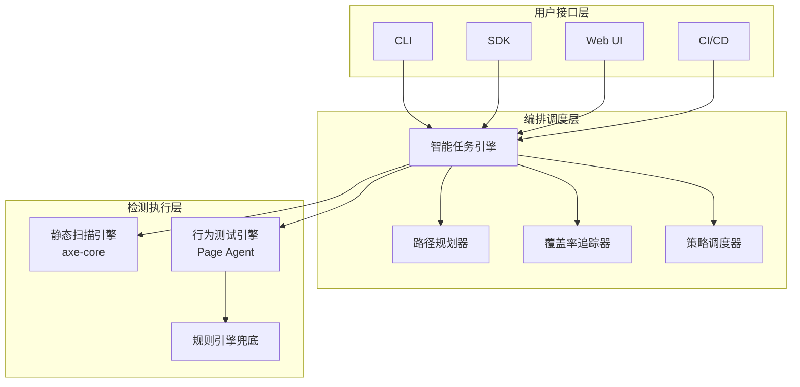

# AccessAudit

基于 AI 的无障碍合规审计平台，融合 **axe-core 静态扫描**与 **LLM 辅助的 Page Agent 行为测试**，确保 WCAG 2.1 AA 和 EN 301 549 合规。

> 一行代码接入，验证真实用户能否完成操作——不只是扫描代码有没有 alt 属性。

## 🎯 核心功能

### 静态合规扫描
- 基于行业标准引擎 **axe-core**
- 检测 WCAG 2.1 AA 级别违规：
  - 缺少 alt 属性
  - 颜色对比度不足
  - 缺少表单标签
  - ARIA 属性误用
  - 语义结构缺陷

### 行为测试（核心差异化）
- **Page Agent** 通过 ReAct 循环像真实用户一样操作页面
- 测试键盘导航、焦点管理和交互流程
- **规则引擎兜底 + LLM 辅助发现** 双重验证机制

| 测试场景 | WCAG 条款 |
|---------|----------|
| 键盘可达性 | 2.1.1 Keyboard |
| 键盘陷阱 | 2.1.2 No Keyboard Trap |
| 焦点可见性 | 2.4.7 Focus Visible |
| 焦点顺序 | 2.4.3 Focus Order |
| Modal 焦点回弹 | 2.4.3 Focus Order |
| Skip Link | 2.4.1 Bypass Blocks |
| 表单错误通知 | 3.3.1 Error Identification |

### 智能任务引擎
- 覆盖率驱动的任务生成
- 黄金路径探索
- 增量扫描策略
- 自动化覆盖率缺口分析

### BYOLLM 支持
- 支持使用自有 LLM，满足 GDPR 合规要求
- 数据不出企业
- 多提供商支持（OpenAI、LangChain）

## 🏗️ 架构设计



## 📦 Monorepo 结构

```
AccessAudit/
├── packages/
│   ├── core/          # 核心引擎（axe-core、Page Agent、规则引擎）
│   ├── cli/           # 命令行接口
│   ├── sdk/           # 软件开发工具包
│   ├── api/           # REST API 服务（NestJS）
│   └── web/           # Web 管理面板（React + MUI）
├── doc/               # 项目文档
└── turbo.json         # Monorepo 构建配置
```

## 🚀 快速开始

### 前置要求

- Node.js >= 18.x
- npm >= 9.x
- Playwright 浏览器（用于行为测试）

### 安装步骤

```bash
# 克隆仓库
git clone https://gitee.com/wangfei/AccessAudit.git
cd AccessAudit

# 安装依赖
npm install

# 构建所有包
npm run build

# 安装 Playwright 浏览器（用于行为测试）
npx playwright install
```

### CLI 使用

```bash
# 执行快速静态扫描
npx accessaudit scan https://example.com

# 执行完整审计（包含行为测试）
npx accessaudit audit --urls https://example.com --behavior

# 保存报告到指定目录
npx accessaudit audit --urls https://example.com --output ./reports
```

### API 服务

```bash
# 启动 API 服务
npm run start:api

# API 将在 http://localhost:3000 可用
```

### Web 管理面板

```bash
# 启动 Web 开发服务器
npm run start:web

# 管理面板将在 http://localhost:5173 可用
```

### SDK 使用

```typescript
import { AccessAudit } from '@accessaudit/sdk';

const client = new AccessAudit({
  apiKey: process.env.ACCESSAUDIT_API_KEY,
  baseUrl: 'http://localhost:3000',
});

const scanResult = await client.scanner.scan('https://example.com', {
  rules: ['color-contrast', 'image-alt'],
});

const auditResult = await client.engine.audit(['https://example.com'], {
  includeStaticScan: true,
  includeBehaviorTest: true,
});

console.log('扫描违规数:', scanResult.totalViolations);
console.log('审计报告:', auditResult);
```

## 🔧 配置说明

### LLM 配置

在项目根目录创建 `.env` 文件：

```env
# OpenAI 配置
OPENAI_API_KEY=your-api-key
OPENAI_MODEL=gpt-4o

# 或者使用 BYOLLM
LLM_PROVIDER=openai
LLM_BASE_URL=https://api.openai.com/v1
```

### 审计配置

创建 `audit.config.json` 文件：

```json
{
  "includeStaticScan": true,
  "includeBehaviorTest": true,
  "scanRules": ["color-contrast", "image-alt", "label", "aria-valid-attr"],
  "behaviorTests": ["keyboard-reachability", "keyboard-trap", "focus-visibility"],
  "goldenPaths": [
    {
      "name": "结账流程",
      "steps": ["click button#add-to-cart", "click a#checkout", "fill form#shipping"]
    }
  ],
  "enableExploratory": false
}
```

## 📊 覆盖率指标

AccessAudit 追踪以下覆盖率指标，确保测试全面性：

| 指标 | 目标值 | WCAG 参考 |
|------|--------|----------|
| 键盘可达率 | 100% | 2.1.1 |
| 焦点可见率 | 100% | 2.4.7 |
| 名称计算匹配率 | 100% | 4.1.2 |
| 角色语义正确率 | 100% | 4.1.2 |
| Modal 焦点回弹率 | 100% | 2.4.3 |
| 黄金路径覆盖率 | 100% | 业务关键路径 |
| 组件交互覆盖率 | 95%+ | 全面覆盖 |

## 📋 合规标准

- **WCAG 2.1 Level AA** - 网页内容无障碍指南
- **EN 301 549** - 欧洲 ICT 无障碍标准
- **EAA（欧洲无障碍法案）** - 欧盟强制要求（2025 年 6 月 28 日生效）

## 🛠️ 开发指南

```bash
# 运行所有测试
npm run test

# 代码检查
npm run lint

# 代码格式化
npm run format

# 构建指定包
npm run build --workspace=@accessaudit/cli
```

## 🤝 贡献指南

欢迎贡献代码！请参考我们的 [开发规范](doc/development-spec.md) 获取更多详情。

## 📄 许可证

本项目采用 MIT 许可证。

## 🔗 参考资源

- [axe-core](https://github.com/dequelabs/axe-core)
- [Playwright](https://playwright.dev/)
- [WCAG 2.1](https://www.w3.org/TR/WCAG21/)
- [EN 301 549](https://www.etsi.org/deliver/etsi_en/301500_301599/301549/)
