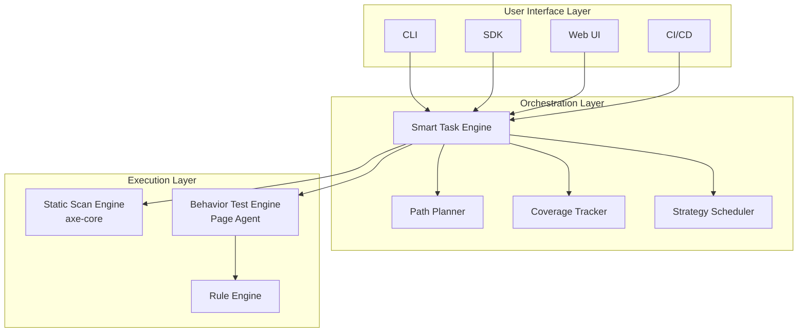

# AccessAudit

An AI-powered accessibility compliance audit platform that combines **axe-core static scanning** with **LLM-assisted Page Agent behavioral testing** to ensure WCAG 2.1 AA and EN 301 549 compliance.

> One line of code to verify if real users can complete operations - not just scanning for missing alt attributes.

## 🎯 Key Features

### Static Compliance Scanning
- Built on **axe-core**, the industry-standard accessibility engine
- Detects WCAG 2.1 AA level violations:
  - Missing alt attributes
  - Insufficient color contrast
  - Missing form labels
  - ARIA attribute misusage
  - Semantic structure defects

### Behavioral Testing (Core Differentiation)
- **Page Agent** operates like a real user through ReAct loops
- Tests keyboard navigation, focus management, and interaction flows
- **Rule Engine Fallback + LLM-Assisted Discovery** for deterministic assertions

| Test Scenario | WCAG Reference |
|--------------|---------------|
| Keyboard Reachability | 2.1.1 Keyboard |
| Keyboard Trap | 2.1.2 No Keyboard Trap |
| Focus Visibility | 2.4.7 Focus Visible |
| Focus Order | 2.4.3 Focus Order |
| Modal Focus Return | 2.4.3 Focus Order |
| Skip Link | 2.4.1 Bypass Blocks |
| Form Error Notification | 3.3.1 Error Identification |

### Smart Task Engine
- Coverage-driven test generation
- Golden path exploration
- Incremental scanning strategy
- Automated coverage gap analysis

### BYOLLM Support
- Bring Your Own LLM for GDPR compliance
- Data never leaves your enterprise
- Multi-provider support (OpenAI, LangChain)

## 🏗️ Architecture



## 📦 Monorepo Structure

```
AccessAudit/
├── packages/
│   ├── core/          # Core engine (axe-core, Page Agent, Rule Engine)
│   ├── cli/           # Command-line interface
│   ├── sdk/           # Software development kit
│   ├── api/           # REST API server (NestJS)
│   └── web/           # Web UI dashboard (React + MUI)
├── doc/               # Documentation
└── turbo.json         # Monorepo build configuration
```

## 🚀 Quick Start

### Prerequisites

- Node.js >= 18.x
- npm >= 9.x
- Playwright browsers (for behavioral testing)

### Installation

```bash
# Clone the repository
git clone https://gitee.com/wangfei/AccessAudit.git
cd AccessAudit

# Install dependencies
npm install

# Build all packages
npm run build

# Install Playwright browsers (for behavioral testing)
npx playwright install
```

### CLI Usage

```bash
# Run a quick static scan
npx accessaudit scan https://example.com

# Run complete audit with behavioral testing
npx accessaudit audit --urls https://example.com --behavior

# Save report to directory
npx accessaudit audit --urls https://example.com --output ./reports
```

### API Server

```bash
# Start the API server
npm run start:api

# The API will be available at http://localhost:3000
```

### Web Dashboard

```bash
# Start the Web development server
npm run start:web

# The dashboard will be available at http://localhost:5173
```

### SDK Usage

```typescript
import { AccessAudit } from '@accessaudit/sdk';

const client = new AccessAudit({
  apiKey: process.env.ACCESSAUDIT_API_KEY,
  baseUrl: 'http://localhost:3000',
});

const scanResult = await client.scanner.scan('https://example.com', {
  rules: ['color-contrast', 'image-alt'],
});

const auditResult = await client.engine.audit(['https://example.com'], {
  includeStaticScan: true,
  includeBehaviorTest: true,
});

console.log('Scan violations:', scanResult.totalViolations);
console.log('Audit report:', auditResult);
```

## 🔧 Configuration

### LLM Configuration

Create a `.env` file in the project root:

```env
# OpenAI configuration
OPENAI_API_KEY=your-api-key
OPENAI_MODEL=gpt-4o

# Alternatively, use BYOLLM
LLM_PROVIDER=openai
LLM_BASE_URL=https://api.openai.com/v1
```

### Audit Configuration

Create an `audit.config.json` file:

```json
{
  "includeStaticScan": true,
  "includeBehaviorTest": true,
  "scanRules": ["color-contrast", "image-alt", "label", "aria-valid-attr"],
  "behaviorTests": ["keyboard-reachability", "keyboard-trap", "focus-visibility"],
  "goldenPaths": [
    {
      "name": "Checkout Flow",
      "steps": ["click button#add-to-cart", "click a#checkout", "fill form#shipping"]
    }
  ],
  "enableExploratory": false
}
```

## 📊 Coverage Metrics

AccessAudit tracks the following coverage metrics to ensure comprehensive testing:

| Metric | Target | WCAG Reference |
|--------|--------|---------------|
| Keyboard Reach Rate | 100% | 2.1.1 |
| Focus Visible Rate | 100% | 2.4.7 |
| Name Computation Rate | 100% | 4.1.2 |
| Role Semantics Rate | 100% | 4.1.2 |
| Modal Focus Return Rate | 100% | 2.4.3 |
| Golden Path Coverage | 100% | Business Critical |
| Component Interaction Coverage | 95%+ | Comprehensive |

## 📋 Compliance Standards

- **WCAG 2.1 Level AA** - Web Content Accessibility Guidelines
- **EN 301 549** - European ICT Accessibility Standard
- **EAA (European Accessibility Act)** - EU Mandate (effective June 28, 2025)

## 🛠️ Development

```bash
# Run all tests
npm run test

# Run linting
npm run lint

# Format code
npm run format

# Build specific package
npm run build --workspace=@accessaudit/cli
```

## 🤝 Contributing

Contributions are welcome! Please refer to our [development specifications](doc/development-spec.md) for more details.

## 📄 License

This project is licensed under the MIT License.

## 🔗 References

- [axe-core](https://github.com/dequelabs/axe-core)
- [Playwright](https://playwright.dev/)
- [WCAG 2.1](https://www.w3.org/TR/WCAG21/)
- [EN 301 549](https://www.etsi.org/deliver/etsi_en/301500_301599/301549/)
