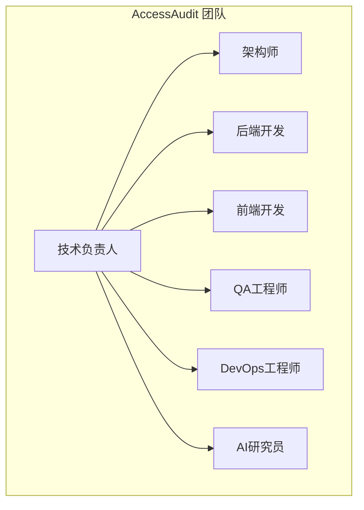

# AccessAudit 项目管理计划

> 技术经理视角：AI 团队组建与执行保障
> 版本：v1.0
> 更新日期：2026-07-25

---

## 目录

1. [项目文档评估](#1-项目文档评估)
2. [文档补充计划](#2-文档补充计划)
3. [团队组建与工作分配](#3-团队组建与工作分配)
4. [项目执行保障](#4-项目执行保障)
5. [交付管理](#5-交付管理)
6. [风险预警机制](#6-风险预警机制)

---

## 1. 项目文档评估

### 1.1 现有文档清单

| 文档名称 | 路径 | 状态 | 完整性 | 评估 |
|---------|------|------|--------|------|
| PRD | [prd-ch.md](file:///Users/wangfei/git/gitee/AccessAudit/doc/prd-ch.md) | ✅ 已完成 | 85% | 需求清晰，商业模式完整 |
| 系统架构设计 | [system-architecture.md](file:///Users/wangfei/git/gitee/AccessAudit/doc/system-architecture.md) | ✅ 已完成 | 80% | 含 Mermaid 图表，组件边界清晰 |
| Page Agent 设计 | [page-agent.md](file:///Users/wangfei/git/gitee/AccessAudit/doc/page-agent.md) | ✅ 已完成 | 75% | 核心逻辑完整，缺详细实现 |
| 开源启动计划 | [open-source-launch-plan.md](file:///Users/wangfei/git/gitee/AccessAudit/doc/open-source-launch-plan.md) | ✅ 已完成 | 90% | 时间线清晰，里程碑明确 |
| EAA 合规指南 | [eaa-compliance-guide.md](file:///Users/wangfei/git/gitee/AccessAudit/doc/eaa-compliance-guide.md) | ✅ 已完成 | 85% | 法规覆盖全面，含声明模板 |
| 合规自查清单 | [compliance-checklist.md](file:///Users/wangfei/git/gitee/AccessAudit/doc/compliance-checklist.md) | ✅ 已完成 | 90% | 105项检查，优先级明确 |
| 测试网站清单 | [10-website.md](file:///Users/wangfei/git/gitee/AccessAudit/doc/10-website.md) | ✅ 已完成 | 95% | 10个欧洲企业网站 |
| ln.md | [ln.md](file:///Users/wangfei/git/gitee/AccessAudit/doc/ln.md) | ❓ 未知 | - | 需要审查内容 |

### 1.2 缺失文档清单

| 文档类型 | 优先级 | 说明 | 影响 |
|---------|--------|------|------|
| **API 文档** | P0 | 核心模块接口定义 | 开发无法并行 |
| **开发规范** | P0 | 代码规范、目录结构、命名约定 | 团队协作混乱 |
| **测试计划** | P0 | 测试用例、测试流程、验收标准 | 无法保证质量 |
| **数据库设计** | P1 | 数据模型、表结构 | 存储层无法开发 |
| **部署文档** | P1 | 环境配置、CI/CD流程 | 无法上线 |
| **验收标准** | P0 | 各阶段交付物验收标准 | 无法判断完成 |

### 1.3 评估结论

| 维度 | 评分 | 说明 |
|------|------|------|
| 需求规格 | ⭐⭐⭐⭐ | PRD 完整，需求清晰 |
| 系统架构 | ⭐⭐⭐⭐ | 架构设计完整，含图表 |
| API 设计 | ⭐ | 严重缺失，无接口定义 |
| 数据库设计 | ⭐ | 严重缺失，无数据模型 |
| 开发规范 | ⭐ | 严重缺失，无编码标准 |
| 测试计划 | ⭐ | 严重缺失，无测试方案 |
| **综合评估** | **⭐⭐⭐** | **不满足新团队介入开发的最低要求** |

**判定结果**：现有文档仅满足 60% 的开发介入要求，核心技术文档（API、数据库、测试计划）严重缺失。

---

## 2. 文档补充计划

### 2.1 文档补充优先级

| 优先级 | 文档名称 | 预计工时 | 完成标准 | 负责人 |
|--------|---------|---------|---------|--------|
| **P0** | API 文档 | 8h | 所有核心接口定义完成 | 架构师 |
| **P0** | 开发规范 | 4h | 代码规范、目录结构、命名约定 | 技术负责人 |
| **P0** | 测试计划 | 6h | 测试用例模板、测试流程、验收标准 | QA 负责人 |
| **P1** | 数据库设计 | 4h | 数据模型、表结构、索引设计 | 架构师 |
| **P1** | 部署文档 | 4h | 环境配置、CI/CD流程、Docker配置 | DevOps |

### 2.2 文档版本控制机制

```
文档版本控制流程：
┌─────────────────────────────────────────────────────┐
│                                                     │
│  1. 编写/修订文档                                    │
│       │                                             │
│       ▼                                             │
│  2. 提交到 doc/ 目录                                │
│       │                                             │
│       ▼                                             │
│  3. 发起 PR 审查                                    │
│       │                                             │
│       ▼                                             │
│  4. 至少 1 人审查通过                                │
│       │                                             │
│       ▼                                             │
│  5. 合并到 main 分支                                 │
│       │                                             │
│       ▼                                             │
│  6. 更新文档版本号和变更日志                         │
│                                                     │
└─────────────────────────────────────────────────────┘
```

### 2.3 文档模板规范

| 文档类型 | 模板要求 |
|---------|---------|
| API 文档 | OpenAPI 3.0 格式，含请求/响应示例 |
| 开发规范 | Markdown 格式，含目录结构、命名约定、代码示例 |
| 测试计划 | Markdown 格式，含测试用例模板、测试流程 |
| 数据库设计 | Mermaid ER 图 + SQL DDL |

---

## 3. 团队组建与工作分配

### 3.1 AI 团队结构



### 3.2 角色职责定义

| 角色 | 人数 | 职责 | 能力要求 |
|------|------|------|---------|
| **技术负责人** | 1 | 整体技术决策、进度跟踪、风险管控 | 全栈经验、项目管理、无障碍领域知识 |
| **架构师** | 1 | 系统架构设计、API 设计、数据库设计 | 架构设计、TypeScript、Playwright |
| **后端开发** | 2 | 核心检测引擎、规则引擎、任务引擎 | TypeScript、Node.js、axe-core |
| **前端开发** | 1 | CLI、Web UI、报告生成 | TypeScript、React、HTML/CSS |
| **QA 工程师** | 1 | 测试用例设计、自动化测试、验收测试 | Playwright、测试框架、无障碍测试 |
| **DevOps 工程师** | 1 | CI/CD、部署、监控 | GitHub Actions、Docker、K8s |
| **AI 研究员** | 1 | LLM 集成、Prompt 优化、行为测试算法 | LangChain、LLM 技术、Prompt 工程 |

### 3.3 工作分解结构（WBS）

```mermaid
graph TD
    subgraph Phase 1: 基础框架搭建 (第1-2周)
        A1[项目初始化]
        A2[技术栈搭建]
        A3[目录结构设计]
        A4[CI/CD配置]
    end
    
    subgraph Phase 2: 核心引擎开发 (第3-6周)
        B1[静态扫描引擎]
        B2[行为测试引擎]
        B3[规则引擎兜底]
        B4[智能任务引擎]
    end
    
    subgraph Phase 3: 用户接口开发 (第7-8周)
        C1[CLI开发]
        C2[SDK开发]
        C3[Web UI开发]
        C4[报告生成器]
    end
    
    subgraph Phase 4: 测试与验证 (第9-10周)
        D1[单元测试]
        D2[集成测试]
        D3[真实网站验证]
        D4[性能优化]
    end
    
    subgraph Phase 5: 发布与上线 (第11-12周)
        E1[文档完善]
        E2[开源发布]
        E3[社区建设]
        E4[商业化准备]
    end
    
    A1 --> A2 --> A3 --> A4
    A4 --> B1
    B1 --> B2 --> B3 --> B4
    B4 --> C1
    C1 --> C2 --> C3 --> C4
    C4 --> D1
    D1 --> D2 --> D3 --> D4
    D4 --> E1 --> E2 --> E3 --> E4
```

### 3.4 任务分配明细表

#### Phase 1: 基础框架搭建（第1-2周）

| 任务 ID | 任务名称 | 负责人 | 工期 | 交付物 |
|---------|---------|--------|------|--------|
| P1-01 | 项目初始化（pnpm + Turborepo） | 架构师 | 1d | package.json, tsconfig.json |
| P1-02 | Playwright + axe-core 集成 | 后端开发 | 2d | 基础扫描能力 |
| P1-03 | 目录结构设计 | 技术负责人 | 1d | 目录结构规范 |
| P1-04 | GitHub Actions CI/CD | DevOps | 2d | CI/CD 流程 |
| P1-05 | API 文档编写 | 架构师 | 2d | OpenAPI 文档 |

#### Phase 2: 核心引擎开发（第3-6周）

| 任务 ID | 任务名称 | 负责人 | 工期 | 交付物 |
|---------|---------|--------|------|--------|
| P2-01 | 静态扫描引擎（axe-core 封装） | 后端开发 | 3d | 静态扫描模块 |
| P2-02 | 键盘陷阱检测规则引擎 | 后端开发 | 3d | 规则引擎模块 |
| P2-03 | Modal 焦点回弹检测规则引擎 | 后端开发 | 3d | 规则引擎模块 |
| P2-04 | Page Agent 核心实现 | AI 研究员 | 5d | Page Agent 模块 |
| P2-05 | 智能任务引擎 | 架构师 | 4d | 任务引擎模块 |
| P2-06 | 覆盖率追踪器 | 后端开发 | 2d | 覆盖率模块 |

#### Phase 3: 用户接口开发（第7-8周）

| 任务 ID | 任务名称 | 负责人 | 工期 | 交付物 |
|---------|---------|--------|------|--------|
| P3-01 | CLI 开发 | 前端开发 | 3d | CLI 工具 |
| P3-02 | SDK 开发 | 后端开发 | 3d | SDK 包 |
| P3-03 | Web UI 开发 | 前端开发 | 5d | Web 界面 |
| P3-04 | EN 301 549 报告生成器 | 前端开发 | 3d | 报告生成模块 |

#### Phase 4: 测试与验证（第9-10周）

| 任务 ID | 任务名称 | 负责人 | 工期 | 交付物 |
|---------|---------|--------|------|--------|
| P4-01 | 单元测试编写 | QA 工程师 | 3d | 单元测试套件 |
| P4-02 | 集成测试编写 | QA 工程师 | 3d | 集成测试套件 |
| P4-03 | 真实网站验证（10个网站） | 全团队 | 5d | 验证报告 |
| P4-04 | 性能优化 | 架构师 | 2d | 优化报告 |

#### Phase 5: 发布与上线（第11-12周）

| 任务 ID | 任务名称 | 负责人 | 工期 | 交付物 |
|---------|---------|--------|------|--------|
| P5-01 | 文档完善 | 技术负责人 | 3d | 完整文档集 |
| P5-02 | GitHub 开源发布 | DevOps | 2d | 开源仓库 |
| P5-03 | 社区建设（Discord/Twitter） | 技术负责人 | 3d | 社区账号 |
| P5-04 | 商业化准备（云服务原型） | 架构师 | 4d | 云服务原型 |

---

## 4. 项目执行保障

### 4.1 进度跟踪机制

#### 每日站会

```
每日站会流程（15分钟）：
┌─────────────────────────────────────────────────────┐
│                                                     │
│  1. 昨日完成情况（每人1分钟）                         │
│  2. 今日计划（每人1分钟）                            │
│  3. 阻塞问题（每人1分钟）                            │
│  4. 技术负责人总结与协调（3分钟）                    │
│                                                     │
└─────────────────────────────────────────────────────┘
```

#### 进度看板

| 列 | 含义 |
|------|------|
| **Backlog** | 待开发任务 |
| **In Progress** | 进行中任务 |
| **Review** | 待审查任务 |
| **Done** | 已完成任务 |

#### 关键里程碑检查点

| 里程碑 | 时间 | 检查内容 |
|--------|------|---------|
| M1 | 第2周结束 | 基础框架搭建完成，可运行首次扫描 |
| M2 | 第6周结束 | 核心引擎开发完成，可执行行为测试 |
| M3 | 第8周结束 | 用户接口开发完成，可生成合规报告 |
| M4 | 第10周结束 | 测试验证完成，10个网站验证通过 |
| M5 | 第12周结束 | 开源发布，社区建设启动 |

### 4.2 AI 员工工期估算方法

| 因素 | 权重 | 说明 |
|------|------|------|
| **任务复杂度** | 40% | 简单=1d，中等=3d，复杂=5d |
| **上下文熟悉度** | 30% | 熟悉=0.7x，一般=1x，陌生=1.5x |
| **工具/框架经验** | 20% | 熟练=0.8x，一般=1x，陌生=1.3x |
| **代码质量要求** | 10% | 高质量=1.2x，一般=1x |

**估算公式**：
```
预估工时 = 基准工时 × 复杂度系数 × 熟悉度系数 × 经验系数 × 质量系数
```

### 4.3 任务协调策略

#### 并行开发策略

```
并行开发矩阵：
┌─────────────────────────────────────────────────────┐
│ 时间     │ 后端开发        │ 前端开发        │ QA      │
│──────────┼─────────────────┼─────────────────┼────────┤
│ 第3-4周  │ 静态扫描引擎    │ -               │ -       │
│ 第5-6周  │ 行为测试引擎    │ CLI 开发        │ 单元测试│
│ 第7-8周  │ SDK 开发        │ Web UI 开发     │ 集成测试│
│ 第9-10周 │ 性能优化        │ 报告生成器      │ 验证测试│
└─────────────────────────────────────────────────────┘
```

#### 代码审查机制

| 审查级别 | 适用场景 | 审查人数 |
|---------|---------|---------|
| **初级审查** | 小功能、文档更新 | 1人 |
| **中级审查** | 核心功能、API 变更 | 2人 |
| **高级审查** | 架构变更、重大重构 | 3人（含技术负责人） |

---

## 5. 交付管理

### 5.1 各阶段交付物质量标准

#### Phase 1: 基础框架

| 交付物 | 质量标准 | 验收方式 |
|--------|---------|---------|
| package.json | 正确配置工作区、依赖、脚本 | 执行 pnpm install 成功 |
| tsconfig.json | 正确配置路径别名、编译选项 | 执行 pnpm build 成功 |
| CI/CD 流程 | 自动构建、测试、代码检查 | Push 代码触发 CI 成功 |
| API 文档 | OpenAPI 3.0 格式，完整接口定义 | 技术负责人审查 |

#### Phase 2: 核心引擎

| 交付物 | 质量标准 | 验收方式 |
|--------|---------|---------|
| 静态扫描引擎 | 正确集成 axe-core，支持自定义规则 | 单元测试覆盖 ≥80% |
| 行为测试引擎 | 支持键盘陷阱、焦点回弹检测 | 真实网站验证通过 |
| 规则引擎 | 确定性验证，结果可复现 | 测试用例全部通过 |
| 任务引擎 | 支持覆盖率追踪、任务优先级 | 端到端测试通过 |

#### Phase 3: 用户接口

| 交付物 | 质量标准 | 验收方式 |
|--------|---------|---------|
| CLI | 支持扫描命令、参数配置、报告输出 | 手动测试 |
| SDK | 支持 JavaScript/TypeScript 调用 | 集成测试 |
| Web UI | 响应式设计、无障碍友好 | 手动测试 + Lighthouse |
| 报告生成器 | EN 301 549 格式，包含覆盖率数据 | 技术负责人审查 |

#### Phase 4: 测试与验证

| 交付物 | 质量标准 | 验收方式 |
|--------|---------|---------|
| 测试套件 | 单元测试覆盖 ≥80%，集成测试覆盖 ≥60% | 测试报告 |
| 验证报告 | 10个网站验证，准确率 ≥85% | 团队评审 |
| 性能报告 | 单页面扫描 < 30s | 性能测试 |

#### Phase 5: 发布与上线

| 交付物 | 质量标准 | 验收方式 |
|--------|---------|---------|
| 完整文档集 | 所有文档齐全，版本一致 | 文档审查 |
| 开源仓库 | 规范的 README、LICENSE、CONTRIBUTING | GitHub 审查 |
| 社区账号 | Discord、Twitter 账号建立 | 账号验证 |

### 5.2 定期进度汇报机制

| 周期 | 汇报内容 | 受众 |
|------|---------|------|
| **每日** | 站会纪要 | 团队内部 |
| **每周** | 周报（完成情况、进度偏差、风险） | 技术负责人 |
| **每两周** | 里程碑检查 | 全团队 |
| **每月** | 项目状态报告 | 项目负责人 |

### 5.3 项目收尾阶段流程

```
项目收尾流程：
┌─────────────────────────────────────────────────────┐
│                                                     │
│  1. 完成所有开发任务                                 │
│       │                                             │
│       ▼                                             │
│  2. 完成所有测试任务                                 │
│       │                                             │
│       ▼                                             │
│  3. 文档审查与完善                                   │
│       │                                             │
│       ▼                                             │
│  4. 代码审查与合并                                   │
│       │                                             │
│       ▼                                             │
│  5. 部署到测试环境                                   │
│       │                                             │
│       ▼                                             │
│  6. 验收测试                                         │
│       │                                             │
│       ▼                                             │
│  7. 部署到生产环境                                   │
│       │                                             │
│       ▼                                             │
│  8. 交付物整理与归档                                 │
│       │                                             │
│       ▼                                             │
│  9. 项目总结与复盘                                   │
│                                                     │
└─────────────────────────────────────────────────────┘
```

---

## 6. 风险预警机制

### 6.1 风险识别清单

| 风险 ID | 风险描述 | 概率 | 影响 | 优先级 |
|---------|---------|------|------|--------|
| R1 | LLM Token 成本超支 | 高 | 高 | P0 |
| R2 | 行为测试准确率未达 85% | 高 | 高 | P0 |
| R3 | Playwright 兼容性问题 | 中 | 中 | P1 |
| R4 | 欧洲网站反爬机制 | 中 | 中 | P1 |
| R5 | 团队成员离职 | 低 | 高 | P1 |
| R6 | 技术债务积累 | 中 | 中 | P2 |
| R7 | 社区贡献不足 | 低 | 低 | P2 |

### 6.2 风险应对策略

| 风险 ID | 应对策略 | 责任人 |
|---------|---------|--------|
| **R1** | 优化提示词、缓存结果、按消耗计费、设置成本上限 | AI 研究员 |
| **R2** | 规则引擎兜底、双重验证机制、迭代优化 | 架构师 |
| **R3** | 多浏览器测试、降级策略、定期更新 Playwright | 后端开发 |
| **R4** | 模拟真实用户行为、随机延迟、代理轮换 | DevOps |
| **R5** | 文档齐全、代码注释、交叉培训 | 技术负责人 |
| **R6** | Code Review、定期重构、技术债追踪 | 技术负责人 |
| **R7** | 贡献指南、社区活动、贡献者激励 | 技术负责人 |

### 6.3 风险预警指标

| 指标 | 预警阈值 | 触发动作 |
|------|---------|---------|
| Token 消耗 | 超过预算 120% | 触发成本控制流程 |
| 测试准确率 | < 80% | 暂停新功能开发，集中优化 |
| 构建失败率 | > 5% | 暂停代码合并，修复 CI |
| 进度偏差 | > 2周 | 重新评估计划，调整资源 |

---

## 附录

### A. 项目时间线总览

```
项目时间线（12周）：
┌─────────────────────────────────────────────────────┐
│                                                     │
│  第1-2周  │ 基础框架搭建                             │
│  第3-6周  │ 核心引擎开发                             │
│  第7-8周  │ 用户接口开发                             │
│  第9-10周 │ 测试与验证                               │
│  第11-12周│ 发布与上线                               │
│                                                     │
└─────────────────────────────────────────────────────┘
```

### B. 团队成员联系方式

| 角色 | 联系方式 |
|------|---------|
| 技术负责人 | - |
| 架构师 | - |
| 后端开发 | - |
| 前端开发 | - |
| QA 工程师 | - |
| DevOps 工程师 | - |
| AI 研究员 | - |

### C. 项目资源清单

| 资源类型 | 资源名称 | 链接 |
|---------|---------|------|
| 代码仓库 | GitHub | - |
| 文档仓库 | GitBook | - |
| 项目管理 | GitHub Issues | - |
| 沟通工具 | Discord | - |
| CI/CD | GitHub Actions | - |

---

*本项目管理计划旨在确保 AccessAudit 项目有序推进，按时交付高质量产品。实际执行过程中应根据实际情况灵活调整。*