# AccessAudit 系统架构设计

> axe-core + Page Agent 融合架构
> 版本：v1.0
> 更新日期：2026-07-25

---

## 目录

1. [架构概览](#1-架构概览)
2. [组件边界定义](#2-组件边界定义)
3. [静态扫描层（axe-core）](#3-静态扫描层axe-core)
4. [行为测试层（Page Agent）](#4-行为测试层page-agent)
5. [智能任务引擎](#5-智能任务引擎)
6. [覆盖率保障体系](#6-覆盖率保障体系)
7. [数据流转](#7-数据流转)
8. [技术栈选择](#8-技术栈选择)
9. [扩展接口](#9-扩展接口)

---

## 1. 架构概览

### 1.1 整体架构图

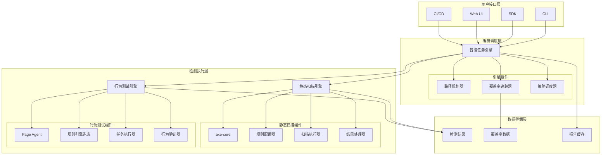

### 1.2 架构核心原则

| 原则 | 说明 |
|------|------|
| **分层解耦** | 各层职责清晰，通过接口通信 |
| **双重验证** | 静态 + 行为，规则引擎兜底 + LLM 辅助 |
| **覆盖率驱动** | 智能任务引擎确保检测全面性 |
| **可扩展性** | 支持自定义规则、自定义任务、BYOLLM |
| **确定性优先** | 关键断言使用规则引擎，LLM 仅做辅助发现 |

---

## 2. 组件边界定义

### 2.1 组件职责矩阵

| 组件 | 职责 | 输入 | 输出 | 边界 |
|------|------|------|------|------|
| **CLI** | 命令行接口，接收用户指令 | URL、配置参数 | 扫描结果、报告路径 | 不处理业务逻辑 |
| **SDK** | 软件开发工具包，供集成使用 | 代码、配置对象 | 检测结果对象 | 不处理 UI |
| **Web UI** | 可视化界面，展示结果和配置 | 用户操作 | 配置、扫描触发 | 不执行检测逻辑 |
| **智能任务引擎** | 编排任务、规划路径、追踪覆盖率 | 配置、页面信息 | 任务列表、覆盖率数据 | 不直接操作 DOM |
| **静态扫描引擎** | 基于 axe-core 的代码级检测 | DOM、规则配置 | 静态违规列表 | 不执行用户交互 |
| **行为测试引擎** | 基于 Page Agent 的交互级检测 | 任务指令、DOM | 行为违规列表 | 不修改页面代码 |
| **规则引擎兜底** | 确定性验证逻辑 | DOM、测试场景 | 验证结果 | 不使用 LLM |
| **报告生成器** | 生成 EN 301 549 格式报告 | 检测结果、覆盖率 | HTML/PDF/JSON 报告 | 不执行检测 |

### 2.2 组件交互流程图

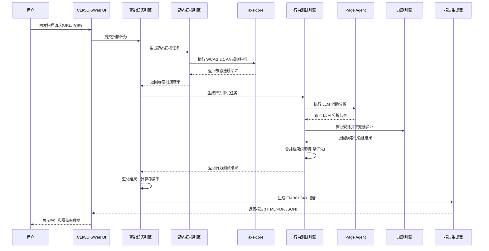

---

## 3. 静态扫描层（axe-core）

### 3.1 静态扫描流程图

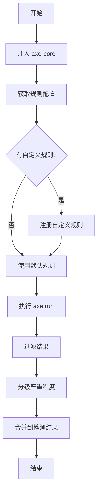

### 3.2 axe-core 集成方案

```typescript
// packages/core/scanner/axe-integration.ts

import axe from 'axe-core';
import type { AxeResults, RuleObject } from 'axe-core';

export class AxeScanner {
  private customRules: RuleObject[] = [];

  registerCustomRule(rule: RuleObject): void {
    this.customRules.push(rule);
  }

  async scan(dom: Document): Promise<AxeResults> {
    const results = await axe.run(dom, {
      rules: {
        'color-contrast': { enabled: true },
        'image-alt': { enabled: true },
        'label': { enabled: true },
        'aria-valid-attr': { enabled: true },
      },
      customRules: this.customRules,
    });

    return this.filterResults(results);
  }

  private filterResults(results: AxeResults): AxeResults {
    return {
      ...results,
      violations: results.violations.filter(v => 
        v.tags.some(tag => tag.startsWith('wcag2aa'))
      ),
    };
  }
}
```

### 3.3 自定义规则扩展

```typescript
// packages/core/scanner/custom-rules.ts

import type { RuleObject } from 'axe-core';

export const customRules: RuleObject[] = [
  {
    id: 'eaa-specific-rule',
    selector: 'input[type="email"]',
    evaluate(node) {
      const ariaDescribedby = node.getAttribute('aria-describedby');
      return ariaDescribedby !== null && 
             document.getElementById(ariaDescribedby) !== null;
    },
    messages: {
      pass: 'Email field has associated error description',
      fail: 'Email field must have aria-describedby for error messages',
    },
    tags: ['wcag2aa', 'eaa'],
  },
];
```

---

## 4. 行为测试层（Page Agent）

### 4.1 行为测试流程图

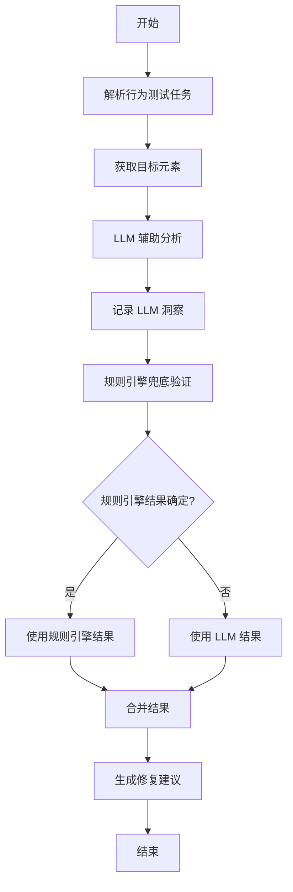

### 4.2 Page Agent 时序图

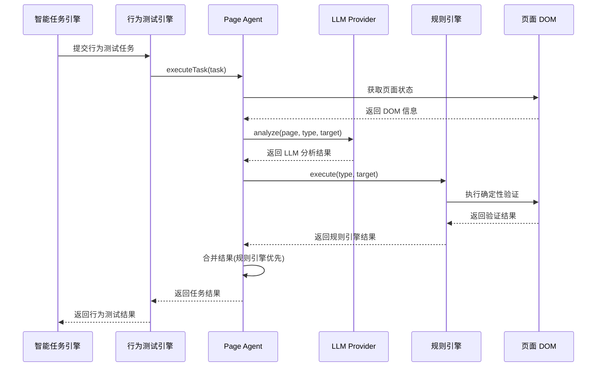

### 4.3 Page Agent 核心实现

```typescript
// packages/core/agent/page-agent.ts

import { Page } from 'playwright';

export class PageAgent {
  private page: Page;
  private llmProvider: LLMProvider;

  constructor(page: Page, llmProvider: LLMProvider) {
    this.page = page;
    this.llmProvider = llmProvider;
  }

  async executeTask(task: BehaviorTask): Promise<TaskResult> {
    const { type, target, expected } = task;

    try {
      const llmResult = await this.llmProvider.analyze(
        this.page, type, target
      );

      const ruleResult = await this.executeRule(type, target);

      return this.mergeResults(llmResult, ruleResult, expected);

    } catch (error) {
      return {
        task,
        status: 'error',
        error: error.message,
      };
    }
  }

  private async executeRule(type: string, target: string): Promise<RuleResult> {
    const ruleEngine = new RuleEngine(this.page);
    return ruleEngine.execute(type, target);
  }

  private mergeResults(
    llmResult: LLMResult,
    ruleResult: RuleResult,
    expected: string
  ): TaskResult {
    if (ruleResult.status !== 'unknown') {
      return {
        task,
        status: ruleResult.status,
        details: {
          ...ruleResult.details,
          llmInsight: llmResult.insight,
        },
      };
    }
    return {
      task,
      status: llmResult.status,
      details: {
        llmInsight: llmResult.insight,
      },
    };
  }
}
```

### 4.4 规则引擎兜底逻辑

```typescript
// packages/core/agent/rule-engine.ts

import { Page } from 'playwright';

export class RuleEngine {
  private page: Page;

  constructor(page: Page) {
    this.page = page;
  }

  async execute(type: string, target: string): Promise<RuleResult> {
    switch (type) {
      case 'keyboard-reachability':
        return this.checkKeyboardReachability(target);
      case 'keyboard-trap':
        return this.checkKeyboardTrap(target);
      case 'focus-visibility':
        return this.checkFocusVisibility(target);
      case 'focus-order':
        return this.checkFocusOrder(target);
      case 'modal-focus-return':
        return this.checkModalFocusReturn(target);
      default:
        return { status: 'unknown', details: {} };
    }
  }

  private async checkKeyboardReachability(target: string): Promise<RuleResult> {
    const unreachable = await this.page.evaluate(() => {
      const interactiveElements = document.querySelectorAll(
        'button, [href], input, select, textarea, [tabindex]:not([tabindex="-1"])'
      );
      const unreachable = [];
      interactiveElements.forEach((el, index) => {
        const tabindex = parseInt(el.getAttribute('tabindex') || '0');
        if (tabindex < 0 || tabindex !== index) {
          unreachable.push(el);
        }
      });
      return unreachable.length;
    });

    return {
      status: unreachable === 0 ? 'pass' : 'fail',
      details: { unreachableCount: unreachable },
    };
  }

  private async checkKeyboardTrap(target: string): Promise<RuleResult> {
    const isTrapped = await this.page.evaluate((selector) => {
      const modal = document.querySelector(selector);
      if (!modal) return false;

      const focusableElements = modal.querySelectorAll(
        'button, [href], input, select, textarea, [tabindex]:not([tabindex="-1"])'
      );

      if (focusableElements.length === 0) return false;

      const first = focusableElements[0];
      const last = focusableElements[focusableElements.length - 1];

      return !(first && last);
    }, target);

    return {
      status: isTrapped ? 'fail' : 'pass',
      details: { isTrapped },
    };
  }
}
```

---

## 5. 智能任务引擎

### 5.1 智能任务引擎架构图

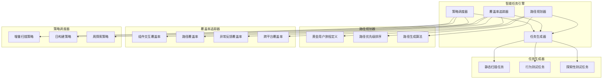

### 5.2 任务生成流程图

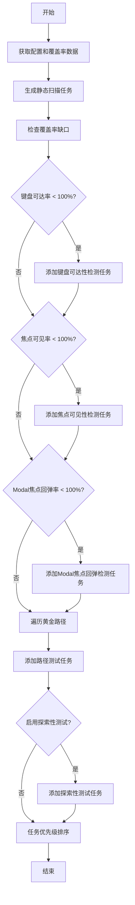

### 5.3 智能任务生成算法

```typescript
// packages/core/engine/task-generator.ts

import type { BehaviorTask, ScanTask } from '../types';

export class TaskGenerator {
  private coverageTracker: CoverageTracker;

  constructor(coverageTracker: CoverageTracker) {
    this.coverageTracker = coverageTracker;
  }

  generateTasks(config: AuditConfig): (ScanTask | BehaviorTask)[] {
    const tasks: (ScanTask | BehaviorTask)[] = [];

    tasks.push(...this.generateStaticTasks(config));
    tasks.push(...this.generateBehaviorTasks(config));

    if (config.enableExploratory) {
      tasks.push(...this.generateExploratoryTasks(config));
    }

    return this.prioritizeTasks(tasks);
  }

  private generateStaticTasks(config: AuditConfig): ScanTask[] {
    return [
      {
        type: 'static-scan',
        name: 'WCAG 2.1 AA 静态扫描',
        rules: config.axeRules,
      },
    ];
  }

  private generateBehaviorTasks(config: AuditConfig): BehaviorTask[] {
    const tasks: BehaviorTask[] = [];
    const coverage = this.coverageTracker.getCoverage();

    if (coverage.keyboardReachRate < 100) {
      tasks.push({
        type: 'keyboard-reachability',
        name: '键盘可达性检测',
        priority: 'high',
      });
    }

    if (coverage.focusVisibleRate < 100) {
      tasks.push({
        type: 'focus-visibility',
        name: '焦点可见性检测',
        priority: 'high',
      });
    }

    if (coverage.modalFocusReturnRate < 100) {
      tasks.push({
        type: 'modal-focus-return',
        name: 'Modal 焦点回弹检测',
        priority: 'high',
      });
    }

    config.goldenPaths.forEach((path, index) => {
      tasks.push({
        type: 'path-test',
        name: `黄金路径 #${index + 1}: ${path.name}`,
        priority: 'high',
        path: path.steps,
      });
    });

    return tasks;
  }

  private generateExploratoryTasks(config: AuditConfig): BehaviorTask[] {
    return [
      {
        type: 'exploratory',
        name: '探索性模糊测试',
        priority: 'low',
        instruction: '寻找最可能导致视障用户卡住的操作',
      },
    ];
  }

  private prioritizeTasks(tasks: (ScanTask | BehaviorTask)[]): (ScanTask | BehaviorTask)[] {
    return tasks.sort((a, b) => {
      const priorityOrder = { high: 0, medium: 1, low: 2 };
      return priorityOrder[a.priority] - priorityOrder[b.priority];
    });
  }
}
```

### 5.4 覆盖率追踪器

```typescript
// packages/core/engine/coverage-tracker.ts

export class CoverageTracker {
  private coverageData: CoverageData = {
    keyboardReachRate: 0,
    focusVisibleRate: 0,
    nameComputationRate: 0,
    roleSemanticsRate: 0,
    modalFocusReturnRate: 0,
    goldenPathCoverage: 0,
    componentInteractionCoverage: 0,
  };

  updateCoverage(type: string, value: number): void {
    this.coverageData[type] = value;
  }

  getCoverage(): CoverageData {
    return { ...this.coverageData };
  }

  getMissingCoverage(): string[] {
    const missing: string[] = [];
    Object.entries(this.coverageData).forEach(([key, value]) => {
      if (value < 100) {
        missing.push(key);
      }
    });
    return missing;
  }
}
```

---

## 6. 覆盖率保障体系

### 6.1 覆盖率维度

| 维度 | 指标 | 计算公式 | 目标值 |
|------|------|---------|--------|
| **键盘可达率** | 可聚焦元素数 / 总交互元素数 | 必须达到 **100%** | WCAG 2.1.1 |
| **焦点可见率** | 有视觉指示的元素数 / 总访问元素数 | 必须接近 **100%** | WCAG 2.4.7 |
| **名称计算匹配率** | 有可计算名称的元素数 / 总交互元素数 | 必须达到 **100%** | WCAG 4.1.2 |
| **角色语义正确率** | 有正确 ARIA Role 的元素数 / 总交互元素数 | 必须达到 **100%** | WCAG 4.1.2 |
| **Modal 焦点回弹率** | 正确回弹的 Modal 数 / 总 Modal 数 | 必须达到 **100%** | WCAG 2.4.3 |
| **黄金路径覆盖率** | 成功执行的路径数 / 总黄金路径数 | 必须达到 **100%** | 业务关键路径 |
| **组件交互覆盖率** | 已访问的交互元素数 / 总交互元素数 | 必须达到 **95%+** | 全面覆盖 |

### 6.2 覆盖率闭环流程图

```mermaid
flowchart LR
    subgraph 覆盖率闭环
        A[用户请求] --> B[智能任务引擎]
        B --> C[检测执行层]
        C --> D[覆盖率追踪器]
        D --> E[缺口分析]
        E --> B
        C --> F[报告展示]
    end

    subgraph 检测执行层
        C1[静态扫描(axe-core)]
        C2[行为测试(Page Agent)]
    end
    C --> C1
    C --> C2
```

### 6.3 覆盖率闭环时序图

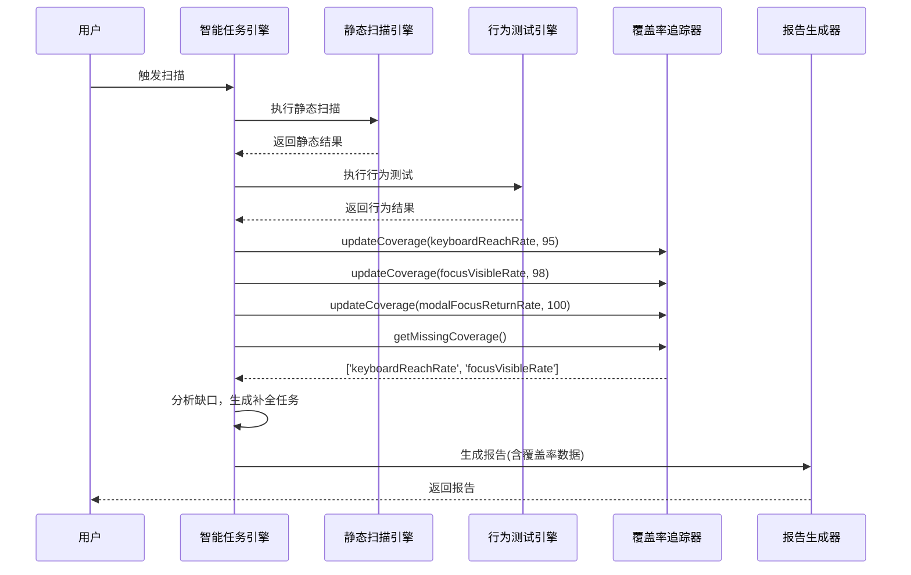

### 6.4 智能调度策略

| 策略 | 触发条件 | 执行内容 | 覆盖率目标 |
|------|---------|---------|-----------|
| **增量扫描** | Git 提交 | 元素枚举策略 | 新增组件 100% 覆盖 |
| **日构建** | 每日凌晨 | 路径规划策略 | 黄金路径 100% 通过 |
| **周探索** | 每周一次 | 模糊测试策略 | 发现非预期问题 |
| **按需扫描** | 用户手动触发 | 全量扫描 | 完整覆盖率报告 |

### 6.5 调度策略流程图

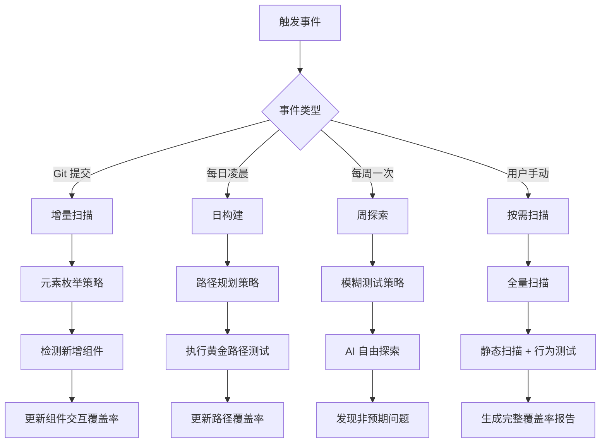

---

## 7. 数据流转

### 7.1 数据流程图

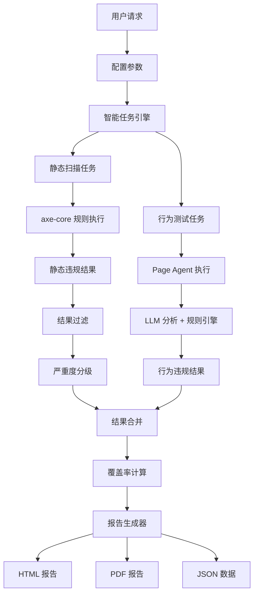

### 7.2 数据流转时序图

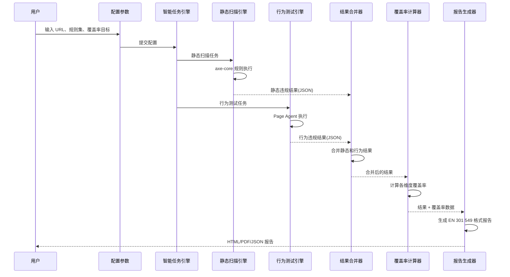

### 7.3 数据格式定义

#### 静态扫描结果

```typescript
interface StaticViolation {
  id: string;
  wcagTag: string;
  severity: 'critical' | 'serious' | 'moderate' | 'minor';
  element: string;
  message: string;
  fixSuggestion: string;
}
```

#### 行为测试结果

```typescript
interface BehaviorViolation {
  id: string;
  wcagTag: string;
  severity: 'critical' | 'serious' | 'moderate' | 'minor';
  testType: string;
  targetElement: string;
  expectedBehavior: string;
  actualBehavior: string;
  llmInsight?: string;
  fixSuggestion: string;
}
```

#### 覆盖率数据

```typescript
interface CoverageData {
  keyboardReachRate: number;
  focusVisibleRate: number;
  nameComputationRate: number;
  roleSemanticsRate: number;
  modalFocusReturnRate: number;
  goldenPathCoverage: number;
  componentInteractionCoverage: number;
}
```

---

## 8. 技术栈选择

### 8.1 核心技术栈

> **注**: 以下版本为目标版本，项目初始化后需根据实际安装情况确认

| 层级 | 技术 | 版本 | 理由 |
|------|------|------|------|
| **语言** | TypeScript | 5.x | 类型安全，成熟生态 |
| **构建工具** | pnpm + Turborepo | latest | 高效的 monorepo 管理 |
| **静态扫描** | axe-core | 4.x | 行业标准，规则完善 |
| **浏览器自动化** | Playwright | 1.x | 多浏览器支持，API 友好 |
| **LLM 集成** | LangChain | 0.x | 多 LLM 支持，BYOLLM |
| **国际化** | i18n-js | latest | 成熟的国际化方案 |
| **CI/CD** | GitHub Actions | latest | 与 GitHub 深度集成 |

### 8.2 各端技术栈详情

> **注**: 以下版本均为目标版本，项目初始化后需根据实际安装情况确认

#### 8.2.1 CLI 端

| 分类 | 技术 | 版本 | 理由 |
|------|------|------|------|
| **命令行框架** | Commander.js | ≥ 11.0.0 | 成熟稳定，API 简洁，社区活跃 |
| **参数解析** | Commander.js 内置 | - | 无需额外依赖 |
| **终端输出** | Chalk | ≥ 5.0.0 | 彩色终端输出，提升用户体验 |
| **进度显示** | Ora | ≥ 7.0.0 | 优雅的 spinner 和进度条 |
| **文件操作** | fs-extra | ≥ 11.0.0 | 增强的文件系统操作 |

#### 8.2.2 SDK 端

| 分类 | 技术 | 版本 | 理由 |
|------|------|------|------|
| **HTTP 客户端** | Axios | ≥ 1.6.0 | 成熟稳定，支持拦截器和自动重试 |
| **类型定义** | TypeScript | ≥ 5.1.0 | 完整的类型支持 |
| **API 封装** | 自定义封装 | - | 轻量级，按需实现 |
| **配置管理** | dotenv | ≥ 16.0.0 | 环境变量管理 |

#### 8.2.3 Web UI 端

| 分类 | 技术 | 版本 | 理由 |
|------|------|------|------|
| **前端框架** | React | ≥ 18.0.0 | 成熟生态，虚拟 DOM，组件化 |
| **UI 组件库** | Material-UI (MUI) | ≥ 5.0.0 | 企业级组件库，无障碍友好 |
| **CSS 策略** | MUI Emotion + Tailwind CSS | ≥ 11.0.0 / ≥ 3.0.0 | MUI 内置样式方案 + Tailwind 原子化样式 |
| **状态管理** | Zustand | ≥ 4.0.0 | 轻量级，简洁 API |
| **路由** | React Router | ≥ 6.0.0 | 标准路由方案 |
| **图表** | Chart.js + react-chartjs-2 | ≥ 4.0.0 | 轻量级图表库 |
| **国际化** | react-i18next | ≥ 13.0.0 | React 国际化标准方案 |
| **构建工具** | Vite | ≥ 5.0.0 | 快速构建，HMR |
| **错误监控** | Sentry | ≥ 7.0.0 | 生产环境错误追踪和性能监控 |

#### 8.2.4 API 服务端

| 分类 | 技术 | 版本 | 理由 |
|------|------|------|------|
| **Web 框架** | NestJS | ≥ 10.0.0 | TypeScript 原生支持，模块化架构 |
| **HTTP 协议** | Fastify | ≥ 4.0.0 | NestJS 默认底层引擎，高性能 |
| **数据库** | PostgreSQL | ≥ 16.0 | 关系型数据库，支持 JSONB |
| **ORM** | Prisma | ≥ 5.0.0 | TypeScript 原生支持，类型安全 |
| **缓存** | Redis | ≥ 7.0 | 高性能缓存，支持任务队列 |
| **认证** | JWT (jsonwebtoken) | ≥ 9.0.0 | 无状态认证，易于扩展 |
| **API 文档** | Swagger (nestjs/swagger) | ≥ 7.0.0 | 自动生成 OpenAPI 文档 |

#### 8.2.5 核心引擎端

| 分类 | 技术 | 版本 | 理由 |
|------|------|------|------|
| **静态扫描** | axe-core | ≥ 4.8.0 | 行业标准，规则完善 |
| **浏览器自动化** | Playwright | ≥ 1.36.0 | 多浏览器支持，API 友好，同时作为端到端测试框架 |
| **LLM 集成** | LangChain.js | ≥ 0.1.0 | 多 LLM 支持，BYOLLM |
| **规则引擎** | 自定义实现 | - | 确保确定性和可复现性 |
| **类型验证** | Zod | ≥ 3.22.0 | TypeScript 原生类型推断 |
| **日志** | Winston | ≥ 3.10.0 | 灵活的日志方案 |

#### 8.2.6 基础设施

| 分类 | 技术 | 版本 | 理由 |
|------|------|------|------|
| **容器化** | Docker | ≥ 24.0.0 | 标准化部署环境，简化 CI/CD |
| **容器编排** | Docker Compose | ≥ 2.20.0 | 本地开发和测试环境编排 |
| **部署** | Kubernetes (K8s) | ≥ 1.28.0 | 生产环境容器编排（可选） |
| **错误监控** | Sentry | ≥ 7.0.0 | 全栈错误追踪和性能监控 |

### 8.3 技术栈架构图

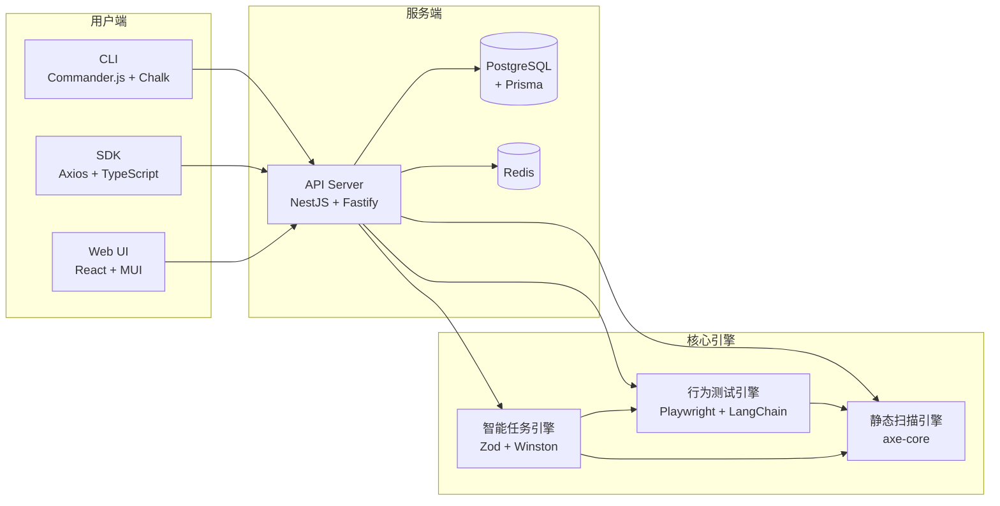

### 8.4 架构决策记录

| 决策 | 选项 | 理由 |
|------|------|------|
| **静态扫描引擎** | axe-core | 行业标准，规则覆盖全面 |
| **行为测试引擎** | Playwright + LLM | 强大的 DOM 操作能力 + AI 智能 |
| **规则引擎** | 自定义实现 | 确保确定性和可复现性 |
| **LLM 策略** | BYOLLM | 满足 GDPR，数据不出企业 |
| **包管理** | pnpm + Turborepo | 高效的 monorepo 管理 |
| **CLI 框架** | Commander.js | 成熟稳定，API 简洁 |
| **前端框架** | React | 成熟生态，无障碍友好 |
| **后端框架** | NestJS | TypeScript 原生支持，模块化 |
| **ORM** | Prisma | 类型安全，自动迁移 |

---

## 9. 扩展接口

### 9.1 规则扩展接口

```typescript
interface CustomRule {
  id: string;
  name: string;
  description: string;
  wcagTags: string[];
  severity: 'critical' | 'serious' | 'moderate' | 'minor';
  evaluate: (dom: Document) => boolean;
  getMessage: (node: HTMLElement) => string;
  getFixSuggestion: (node: HTMLElement) => string;
}

const scanner = new AxeScanner();
scanner.registerCustomRule({
  id: 'custom-rule',
  name: '自定义规则',
});
```

### 9.2 任务扩展接口

```typescript
interface CustomTask {
  type: string;
  name: string;
  priority: 'high' | 'medium' | 'low';
  execute: (page: Page) => Promise<TaskResult>;
}

const engine = new TaskEngine();
engine.registerTask({
  type: 'custom-task',
  name: '自定义任务',
});
```

### 9.3 LLM Provider 接口

```typescript
interface LLMProvider {
  name: string;
  supportsBYOLLM: boolean;
  analyze: (page: Page, type: string, target: string) => Promise<LLMResult>;
}

const provider = new OpenAIProvider({ apiKey: '...' });
const agent = new PageAgent(page, provider);
```

---

## 附录

### A. 关键术语

| 术语 | 解释 |
|------|------|
| **axe-core** | 开源的无障碍静态扫描引擎 |
| **Page Agent** | 基于 LLM 的页面内 AI 代理，能像用户一样操作页面 |
| **ReAct** | Reasoning + Acting，LLM 的思考-行动循环模式 |
| **WCAG** | Web Content Accessibility Guidelines，网页内容无障碍指南 |
| **EN 301 549** | 欧洲 ICT 产品和服务无障碍标准 |
| **EAA** | European Accessibility Act，欧盟无障碍法案 |
| **BYOLLM** | Bring Your Own LLM，使用自己的 LLM |
| **黄金路径** | 网站最关键的用户旅程，如注册、购买、支付等 |

### B. 参考资源

| 资源 | 链接 |
|------|------|
| axe-core | https://github.com/dequelabs/axe-core |
| Playwright | https://playwright.dev/ |
| LangChain | https://langchain.com/ |
| WCAG 2.1 | https://www.w3.org/TR/WCAG21/ |
| EN 301 549 | https://www.etsi.org/deliver/etsi_en/301500_301599/301549/ |

---

*本架构设计文档描述了 AccessAudit 系统的核心组件、交互关系和技术实现方案。实际开发时应根据团队规模和资源情况进行调整。*